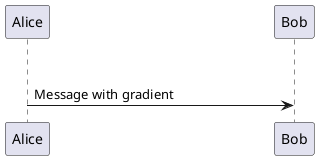

# SVG Gradient Support Implementation

## Overview
Enhanced the SvgDomParser to support SVG linear gradients by converting them to PlantUML's native HColorGradient objects instead of just using the first stop color.

## Changes Made

### 1. SvgDomParser.java Enhancements

#### extractGradientColor() Method
**Before**: Extracted only the first stop color from gradients
**After**: Creates full HColorGradient objects for linear gradients

Key improvements:
- Detects `<linearGradient>` elements and extracts first and last stop colors
- Determines gradient direction by analyzing x1, y1, x2, y2 SVG attributes
- Maps SVG gradient direction to PlantUML policy characters:
  - `|` = Horizontal (left to right)
  - `-` = Vertical (top to bottom) 
  - `/` = Diagonal (top-left to bottom-right)
  - `\` = Diagonal (bottom-left to top-right)
- Falls back to first stop color for radial gradients or when gradient creation fails

#### New Helper Methods

**determineGradientPolicy(Element gradientElement)**
- Parses x1, y1, x2, y2 attributes from SVG linearGradient
- Calculates delta X and delta Y to determine gradient direction
- Returns appropriate PlantUML policy character (`|`, `-`, `/`, `\`)

**parsePercentOrNumber(String value, double defaultValue)**
- Handles both percentage ("50%") and decimal ("0.5") notation
- Returns normalized 0.0-1.0 value for gradient calculations

**parseColor(String colorStr)**
- Simplified to use HColorSet.instance().getColorOrWhite()
- Handles hex colors, rgb/rgba notation, and named colors

### 2. Test Coverage

Added new test case in SvgDomParserTest.java:
```java
@Test
@PumlFile("svgRedRectLinearGradient.puml")
public void testSvgWithLinearGradient(TestInfo testInfo)
```

This test verifies:
- Linear gradient SVG is parsed correctly
- HColorGradient is applied to the UGraphic
- Rectangle is drawn with gradient fill

### 3. Test Resources

**svgRedRectLinearGradient.puml**
- Defines a sprite with horizontal linearGradient from light pink to dark red
- Gradient direction: horizontal (x1="0%" to x2="100%", y1="0%" y2="0%")
- Policy character: `|` (pipe - horizontal)
- Three color stops demonstrating smooth gradient transition

**svgVerticalGradient.puml**
- Defines a sprite with vertical linearGradient from light blue to dark blue
- Gradient direction: vertical (x1="0%" x2="0%", y1="0%" to y2="100%")
- Policy character: `-` (dash - vertical)
- Three color stops demonstrating smooth gradient transition

**svgDiagonalGradientTLBR.puml**
- Defines a sprite with diagonal linearGradient from light purple to dark purple
- Gradient direction: top-left to bottom-right (x1="0%" y1="0%" to x2="100%" y2="100%")
- Policy character: `/` (forward slash - diagonal TL-BR)
- Three color stops demonstrating smooth gradient transition

**svgDiagonalGradientBLTR.puml**
- Defines a sprite with diagonal linearGradient from light yellow/orange to dark orange
- Gradient direction: bottom-left to top-right (x1="0%" y1="100%" to x2="100%" y2="0%")
- Policy character: `\` (backslash - diagonal BL-TR)
- Three color stops demonstrating smooth gradient transition

**testGradientSprite.puml**
- Full PlantUML diagram using the gradient sprite
- Shows gradient in sequence diagram and notes
- Visual verification of gradient rendering

## How It Works

1. **SVG Parsing**: When encountering `fill="url(#grad)"`, the parser:
   - Extracts the gradient ID ("grad")
   - Looks up the gradient element in the defs map
   
2. **Gradient Analysis**: For linearGradient elements:
   - Extracts first and last stop colors
   - Analyzes x1/y1/x2/y2 to determine direction
   - Creates HColorGradient(color1, color2, policy)

3. **Rendering**: PlantUML's rendering engines (SVG, PNG, etc.) handle HColorGradient:
   - SVG output: Creates `<linearGradient>` with proper coordinates
   - PNG output: Uses Java2D GradientPaint
   - Direction is controlled by the policy character

## Example Usage

### Horizontal Gradient (|)


### Vertical Gradient (-)


### Diagonal Gradient TL-BR (/)


### Diagonal Gradient BL-TR (\)


## Testing

Run individual gradient tests:
```bash
# Horizontal gradient (policy: |)
./gradlew test --tests "net.sourceforge.plantuml.emoji.SvgDomParserTest.testSvgWithLinearGradient"

# Test all gradient sprites
./gradlew test --tests "net.sourceforge.plantuml.emoji.SvgSpriteImageGenerationTest"
```

View generated gradient test images:
- Horizontal: `target/test-output/svg-sprites/svgRedRectLinearGradient.png`
- Vertical: `target/test-output/svg-sprites/svgVerticalGradient.png`
- Diagonal (TL-BR): `target/test-output/svg-sprites/svgDiagonalGradientTLBR.png`
- Diagonal (BL-TR): `target/test-output/svg-sprites/svgDiagonalGradientBLTR.png`

Run all SVG parser tests:
```bash
./gradlew test --tests "net.sourceforge.plantuml.emoji.SvgDomParserTest"
```

Generate test images:
```bash
./gradlew test --tests "net.sourceforge.plantuml.emoji.SvgSpriteImageGenerationTest"
```

## Limitations

1. **Radial Gradients**: Still use first stop color (not converted to HColorGradient)
2. **Multiple Stops**: Only first and last stops are used (intermediate stops ignored)
3. **Gradient Transforms**: SVG gradientTransform attribute is not supported
4. **Gradient Units**: Assumes objectBoundingBox (percentages)

## Future Enhancements

- Support for radial gradients
- Gradient color interpolation for multiple stops
- Support for gradientTransform attribute
- Pattern fills and other SVG fill types
