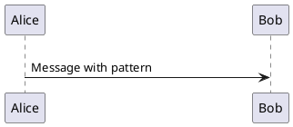

# SVG Polyline Support Implementation

## Overview
Enhanced the SvgDomParser to support SVG `<polyline>` elements by converting them to PlantUML's UPath objects. This enables rendering of multi-point line paths commonly used for charts, waveforms, zigzag patterns, and decorative elements in SVG sprites as true **open paths** (not closed polygons).

## Changes Made

### 1. SvgDomParser.java Enhancements

#### Import Addition
Added `UPath` import to support open polyline rendering:
```java
import net.sourceforge.plantuml.klimt.UPath;
```

**Note**: Initial implementation used `UPolygon`, but this was changed to `UPath` because `UPolygon` automatically closes the path (connects last point to first), which is incorrect for polylines.

#### Case Handler Update
Updated the polyline case in `walkDom()` method:
```java
case "polyline":
    LOG.fine(() -> indent(stackG) + "Handling <polyline> element");
    handlePolyLine(el, ugs, stackG, stack);
    break;
```

#### New handlePolyLine() Method
**Purpose**: Parse SVG polyline points attribute and render as UPath (open path)

Key functionality:
- Parses the `points` attribute containing space-separated x,y coordinate pairs
- Applies scaling and translation from UGraphicWithScale transform
- Creates UPath and uses `moveTo()` for first point, `lineTo()` for subsequent points
- Applies styling through `applyStyleAndTransform()` method
- Handles malformed coordinate pairs gracefully

**Method signature**:
```java
private void handlePolyLine(Element el, UGraphicWithScale ugs, 
                           Deque<GroupState> stackG, 
                           List<UGraphicWithScale> stack)
```

**Implementation details**:
1. Calls `applyStyleAndTransform()` to handle stroke, fill, and stroke-width
2. Extracts `points` attribute from element
3. Retrieves scaling factors (scaleX, scaleY) from affine transform
4. Retrieves translation offsets (deltaX, deltaY) from affine transform
5. Splits points string by whitespace into coordinate pairs
6. Creates `UPath` with identifier "polyline"
7. For each pair:
   - Splits by comma to get x and y coordinates
   - Parses as doubles and applies scaling
   - First point: calls `path.moveTo(x, y)` to start the path
   - Subsequent points: calls `path.lineTo(x, y)` to draw lines
   - Skips invalid points (catches NumberFormatException)
8. Applies final translation and draws the open path

### 2. Test Coverage

Added comprehensive test in SvgDomParserTest.java:

```java
@Test
@PumlFile("svgRedPolyLine.puml")
public void testSvgWithPolyLine(TestInfo testInfo) throws Exception
```

This test verifies:
- Polyline SVG parsing succeeds
- Points are extracted correctly
- UPolygon is drawn to UGraphic
- Styling attributes are applied

### 3. Test Resources

**svgRedPolyLine.puml** (existing file)
- Defines a sprite with a red zigzag polyline
- Points: "0,20 20,5 40,20 60,5 80,20 100,5"
- Demonstrates stroke color, width, and stroke-linecap/linejoin attributes

**testPolylineSprites.puml** (new file)
- Multiple polyline examples showing different patterns:
  - **Zigzag**: Sharp angular pattern with rounded joins
  - **Wave**: Smooth wave pattern
  - **Arrow**: Directional chevron pattern
- Shows polylines in sequence diagrams and notes
- Visual verification of rendering quality

## How It Works

### 1. SVG Parsing
When encountering a `<polyline>` element:
```xml
<polyline points="0,20 20,5 40,20 60,5 80,20 100,5" 
          stroke="#FF0000" 
          stroke-width="4" 
          fill="none"/>
```

### 2. Point Extraction
The `points` attribute is parsed:
- Split by whitespace: `["0,20", "20,5", "40,20", "60,5", "80,20", "100,5"]`
- Each pair split by comma: `["0", "20"]` → `(0.0, 20.0)`
- Applied scaling: `(0.0 * scaleX, 20.0 * scaleY)`

### 3. UPolygon Creation
```java
final UPath path = new UPath("polyline", null);
boolean firstPoint = true;

for (String pair : pointPairs) {
    final double x = ...; // scaled x coordinate
    final double y = ...; // scaled y coordinate
    
    if (firstPoint) {
        path.moveTo(x, y);   // Start the path
        firstPoint = false;
    } else {
        path.lineTo(x, y);   // Draw line to next point
    }
}
```

**Key Design Choice**: Usesath);
```

PlantUML's rendering engines handle UPath:
- **SVG output**: Generates `<path>` element with `M` (moveTo) and `L` (lineTo) commands
- **PNG output**: Uses Java2D drawing with connected line segments
- **Other formats**: Delegates to appropriate renderer

**Output Example**:
```svg
<path d="M70.2866,70.4883 L90.2866,55.4883 L110.2866,70.4883 L130.2866,55.4883 L150.2866,70.4883 L170.2866,55.4883" 
      fill="none" 
      id="polyline" 
      style="stroke:#FF0000;stroke-width:4;"/>
```

This is a true **open path** - the last point does NOT connect back to the first.
- **stroke**: Sets foreground color (`#FF0000` → red)
- **stroke-width**: Sets line thickness (`4` → 4px scaled)
- **fill**: Sets background/fill color (`none` → transparent)

### 5. Rendering
```java
final UTranslate translate = new UTranslate(deltax, deltay);
ugs.apply(translate).draw(polygon);
```

PlantUML's rendering engines handle UPolygon:
- **SVG output**: Generates `<polygon>` or `<polyline>` element
- **PNG output**: Uses Java2D drawing with connected line segments
- **Other formats**: Delegates to appropriate renderer

## Example Usage

### Basic Polyline Sprite


### Multiple Polyline Patterns

```plantuml
@startuml
sprite wave <svg viewBox="0 0 120 40">
  <polyline points="0,20 15,5 30,20 45,35 60,20 75,5" 
            stroke="#0000FF" 
            stroke-width="3" 
            fill="none"/>
</svg>

sprite chart <svg viewBox="0 0 100 50">
  <polyline points="0,45 20,30 40,35 60,15 80,20 100,5" 
            stroke="#00AA00" 
            stroke-width="2" 
            fill="none"/>
</svg>

note right
  <$wave> Wave pattern
  <$chart> Chart line
end note
@enduml
```


### Filled Polyline (Polygon-like)


## Testing

### Run Polyline Test
```bash
./gradlew test --tests "net.sourceforge.plantuml.emoji.SvgDomParserTest.testSvgWithPolyLine"
```

### Run All SVG Parser Tests
```bash
./gradlew test --tests "net.sourceforge.plantuml.emoji.SvgDomParserTest"
```

### Generate Test Images
```bash
./gradlew test --tests "net.sourceforge.plantuml.emoji.SvgSpriteImageGenerationTest"
```

Check generated images in `build/test-results/` directory.

## Limitations and Constraints

### 1. Point Format Parsing
**Constraint**: Only supports space-separated coordinate pairs
- **Supported**: `"0,20 20,5 40,20"` (space separators)
- **Not Supported**: `"0,20,20,5,40,20"` (no spaces)
- **Not Supported**: `"0 20 20 5 40 20"` (space-separated values without commas)

**Workaround**: Preprocess SVG files to use standard space-and-comma format.

### 2. Coordinate Precision
**Constraint**: Uses double parsing, may lose precision for very small/large values
- **Impact**: Sub-pixel positioning may be affected
- **Mitigation**: SVG viewBox scaling usually prevents issues

### 3. Stroke Attributes
**Limited Support**: Some SVG stroke attributes are not fully implemented:
- ✅ **Supported**: `stroke`, `stroke-width`, `fill`
- ⚠️rrect Behavior**: UPath respects polyline semantics
- **SVG polyline**: Open path, fill attribute typically "none"
- **PlantUML UPath**: Renders as open path, respects fill="none"
- **Impact**: Polylines render correctly as open paths

**Previous Issue (UPolygon)**: UPolygon auto-closed the path, creating unwanted polygons
**Solution**: Switched to UPath for true polyline behavior

**Impact**: Complex stroke styling may not render as expected.

### 4. Fill Behavior
**Constraint**: UPolygon treats polyline as closed polygon for fill
- **SVG polyline**: Open path, fill connects last point to first
- **PlantUML UPolygon**: Implicitly closes the shape
- **Impact**: If `fill` is specified, the polyline will be rendered as a closed polygon

**Workaround**: Use `fill="none"` for true open polylines.

### 5. Transform Limitations
**Constraint**: Only basic translate and scale transforms are applied
- ✅ **Supported**: Translation (x, y offset), Scale (viewBox)
- ❌ **Not Supported**: 
  - Rotation transforms
  - Skew transforms
  - Matrix transforms
  - Transform attribute on `<polyline>` element itself

**Impact**: Rotated or skewed polylines will not render correctly.

### 6. Point Count
**No Hard Limit**: UPolygon can handle many points, but:
- **Performance**: Very large point counts (>1000) may slow rendering
- **Memory**: Each point allocates memory
- **Recommendation**: Keep polylines under 200-300 points for optimal performance

### 7. Relative vs Absolute Coordinates
**Constraint**: Only absolute coordinates are supported
- ✅ **Supported**: `points="0,20 20,5 40,20"` (absolute)
- ❌ **Not Supported**: Relative coordinate notation (not standard for polyline anyway)

### 8. Error Handling
**Graceful Degradation**:
- Invalid coordinate pairs are **skipped silently**
- No error message displayed to user
- Polyline renders with valid points only

**Example**:
```xml
<polyline points="0,20 invalid 40,20 60,5"/>
```
Renders as: `(0,20) → (40,20) → (60,5)` (middle point skipped)

##Correct Distinction**:
- SVG `<polyline>`: Open path (does not auto-close) ✅
- PlantUML `UPath`: Open path (does not auto-close) ✅

**Previous Implementation**: Used `UPolygon` which auto-closed the path
**Current Implementation**: Uses `UPath` for correct open-path behavior
**Future Enhancement**: Consider using `UPath` for true polyline support.

### 10. Color Gradient Support
**Constraint**: Polyline stroke colors inherit gradient support from main implementation
- ✅ **Supported**: Linear gradients on stroke (via gradient implementation)
- ⚠️ **Limited**: Gradient fills may not render correctly
- ❌ **Not Supported**: Gradient along path (SVG gradient units="userSpaceOnUse")

## Performance Considerations

### Memory Usage
- Each point: ~24 bytes (2 doubles + object overhead)
- 100-point polyline: ~2.4 KB
- Generally negligible for typical sprite use

### Parsing Performance
- String split operations: O(n) where n = number of points
- Double parsing: O(1) per point
- Overall: Linear time complexity, very fast for typical polylines

### Rendering Performance
- Depends on renderer implementation
- SVG output: Fast (direct XML generation)
- PNG output: Moderate (Java2D line drawing)
- Complex patterns (many sprites): May accumulate

## Future Enhancements

### Potential Improvements
1. **True Polyline Support**: Use `UPath` instead of `UPolygon` for open paths
2. ~~**True Polyline Support**: Use `UPath` instead of `UPolygon` for open paths~~ ✅ **IMPLEMENTED**t`
3. **Advanced Transforms**: Support rotate, skew, and matrix transforms
4. **Smooth Curves**: Support curved polyline segments (SVG paths)
5. **Marker Support**: Implement `marker-start`, `marker-mid`, `marker-end` attributes
6. **Better Error Reporting**: Log warnings for invalid coordinates
7. **Coordinate Format Flexibility**: Support comma-only or space-only separation
8. **Polygon Element**: Add separate handler for `<polygon>` (auto-closing)

### Compatibility Notes
- **SVG 1.1**: Fully compatible with standard polyline syntax
- **SVG 2.0**: Basic compatibility, advanced features not supported
- **PlantUML Version**: Tested with 1.2025.11beta5

## Related Implementations
- **Gradient Support**: See [GRADIENT_IMPLEMENTATION.md](GRADIENT_IMPLEMENTATION.md)
- **Path Support**: Uses existing `SvgPath` for `<path>` elements
- **Shape Support**: Rectangle, circle, ellipse, line handlers follow same pattern

## Troubleshooting

### Polyline Not Rendering
1. **Check points format**: Ensure space-separated pairs: `"x1,y1 x2,y2"`
2. **Check stroke color**: Must have `stroke` attribute (or inherits from parent)
3. **Check viewBox**: Verify coordinates are within viewBox bounds
4. **Check test logs**: Look for "Handling <polyline> element" in FINE logs

### Incorrect Positioning
1. **Verify scaling**: Check SVG viewBox vs sprite usage scale
2. **Check transforms**: Ensure no conflicting transform attributes
3. **Test simple case**: Try `points="0,0 10,10"` to verify basic rendering

### Performance Issues
1. **Reduce point count**: Simplify polyline with fewer points
2. **Optimize sprite count**: Limit number of polyline sprites per diagram
3. **Check point data**: Ensure no duplicate/redundant points
