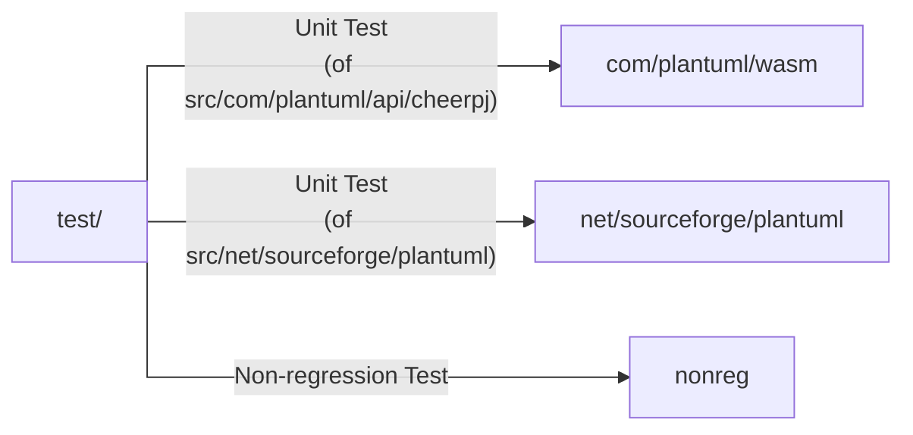

# Testing PlantUML

## Prerequisites

See the [Building page](../BUILDING.md) and especilay the paragraph [Building PlantUML with Gradle](../BUILDING.md#building-plantuml-with-gradle).

## Running Tests

### Run all tests, for all licences

To run the tests included with the project, use the following command:

```sh
gradle test
```

### Run a specific test, for only one licence

Comment those lines on [`settings.gradle.kts`](../settings.gradle.kts):

https://github.com/plantuml/plantuml/blob/a327d636a7fcc7f05a88b796a2838da16e2ba3e3/settings.gradle.kts#L12-L16

Then you can run a specific test _(e.g. the `aTestClass` Class)_:
```sh
gradle test --tests aTestClass
```

## Contributing

After successfully building and testing the project, you are ready to start [contributing](../CONTRIBUTING.md) to PlantUML!
If you have any changes to contribute, please submit a pull request through the [PlantUML GitHub repository](https://github.com/plantuml/plantuml).


## Test Directory Architecture

- [test/](../test)
  - [com/plantuml/wasm](../test/com/plantuml/wasm)
  - [net/sourceforge/plantuml](../test/net/sourceforge/plantuml)
  - [nonreg](../test/nonreg)



## Additional Resources

### Gradle
- site: [Gradle](https://gradle.org)
- doc: [Gradle User Guide](https://docs.gradle.org/current/userguide/userguide.html)
- src: [:octocat:Gradle](https://github.com/gradle/gradle) 

### Gradle Plugins
- site: [Gradle Plugins Search](https://plugins.gradle.org)
- A "gradle test logger plugin"
  - src: [:octocat:radarsh/gradle-test-logger-plugin](https://github.com/radarsh/gradle-test-logger-plugin)

### JUnit
- site: [JUnit5](https://junit.org/junit5/)
- doc: [JUnit User Guide](https://junit.org/junit5/docs/current/user-guide/)
- src: [:octocat:JUnit-team](https://github.com/junit-team)

### JUnit extensions
- doc: [JUnit extensions](https://junit.org/junit5/docs/current/user-guide/#extensions)
- The "Glytching" JUnit extensions
  - doc: [Glytching JUnit extensions](https://glytching.github.io/junit-extensions/)
  - doc: [`randomBeans` doc](https://glytching.github.io/junit-extensions/randomBeans)
  - src: [:octocat:glytching/junit-extensions](https://github.com/glytching/junit-extensions)

### AssertJ
- doc: [AssertJ](https://assertj.github.io/doc/)
- src: [:octocat:AssertJ](https://github.com/assertj/assertj)

### Mockito
- site: [Mockito](https://site.mockito.org)
- doc: [Mockito doc.](https://javadoc.io/doc/org.mockito/mockito-core/latest/org/mockito/Mockito.html)
- src: [:octocat:Mockito](https://github.com/mockito/mockito)
