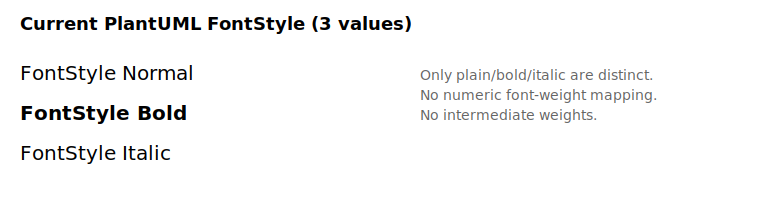
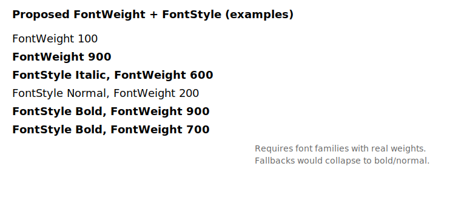

# Feature request: SVG Sprite font-weight support via TextAttribute and richer PlantUML FontStyle weight handling

**Is your feature request related to a problem? Please describe.**
Numeric CSS font-weight values (100-900) are currently reduced to bold/normal in the SAX SVG sprite parser and ignored in the Nano parser. PlantUML's style system also treats `FontStyle` as a three-value flag (plain, bold, italic), so it cannot represent intermediate weight levels. This prevents SVG sprites and PlantUML styles from rendering weights beyond bold/normal, even when the font provides those faces.

**Describe the solution you'd like**
Use Java2D `TextAttribute.WEIGHT` and `TextLayout` so numeric weights can be honored when the font provides matching faces, and extend PlantUML styling with an optional `FontWeight` attribute. This keeps `FontStyle` responsible for italic/oblique while weight is handled independently.

High-level changes:
- Extend `UFont`/`UFontFactory` to accept an optional weight.
- Map CSS weights (100-900 and keywords) to `TextAttribute.WEIGHT` constants.
- Apply `FontWeight` across style-driven rendering paths, including SVG sprites.
- Fall back to bold/normal when a font does not supply weighted faces.

**Describe alternatives you've considered**
- Keep the current bold/normal behavior and document the limitation.
- Map all SVG weights to bold/normal (status quo for SAX; Nano ignores weight).
- Add SVG-only weight handling without exposing a style-level `FontWeight`.

**Additional context**
Current behavior:
- SAX parser: numeric `font-weight` is parsed and mapped to bold/normal only.
- Nano parser: `font-weight` is not parsed.
- PlantUML `FontStyle` maps only to plain, bold, or italic.

Visual comparison:




Current PlantUML style behavior for `FontStyle`:
- `bold` -> `Font.BOLD`
- `italic` -> `Font.ITALIC`
- anything else -> `Font.PLAIN`

Possible extension: `FontWeight` style attribute
Add a new `FontWeight` style property that accepts CSS values (`normal`, `bold`, `bolder`, `lighter`, or 100-900). When supplied, it maps to `TextAttribute.WEIGHT` and falls back to bold/normal if a weighted face is not available.

Potential interaction rules:
- `FontStyle=italic` with `FontWeight=900` should produce italic + heavy weight.
- `FontStyle=normal` with `FontWeight=900` should still produce a heavy weight.
- `FontStyle=bold` with `FontWeight=100` should honor the explicit weight and keep style as normal.

If both `FontStyle` and `FontWeight` are provided, a clear precedence rule should be defined (e.g., `FontWeight` controls weight only; `FontStyle` controls italic/oblique only). This mirrors CSS, where `font-style` and `font-weight` are independent axes.

Examples of fonts with and without weight families (typical availability):
- Multiple weights: Helvetica Neue, Noto Sans/Serif, Source Sans/Serif, Roboto, Open Sans.
- Limited weights: Arial, Times New Roman, Verdana, Georgia, Tahoma, Courier New.

Example code sketch (Java2D weights):
```java
import java.awt.Font;
import java.awt.font.TextAttribute;
import java.text.AttributedString;
import java.util.HashMap;
import java.util.Map;

// Example utility: map CSS numeric weights to Java2D weights
// TextAttribute weight constants and their Float values:
// EXTRA_LIGHT=0.5f, LIGHT=0.75f, DEMILIGHT=0.875f, REGULAR=1.0f,
// SEMIBOLD=1.25f, MEDIUM=1.5f, DEMIBOLD=1.75f, BOLD=2.0f,
// HEAVY=2.25f, EXTRABOLD=2.5f, ULTRABOLD=2.75f
private static Float toTextAttributeWeight(int cssWeight) {
  if (cssWeight <= 200)
    return TextAttribute.WEIGHT_EXTRA_LIGHT;
  if (cssWeight <= 300)
    return TextAttribute.WEIGHT_LIGHT;
  if (cssWeight <= 400)
    return TextAttribute.WEIGHT_REGULAR;
  if (cssWeight <= 500)
    return TextAttribute.WEIGHT_MEDIUM;
  if (cssWeight <= 600)
    return TextAttribute.WEIGHT_SEMIBOLD;
  if (cssWeight <= 700)
    return TextAttribute.WEIGHT_BOLD;
  if (cssWeight <= 800)
    return TextAttribute.WEIGHT_HEAVY;
  return TextAttribute.WEIGHT_ULTRABOLD;
}

// Example: derive a weighted font
private static Font deriveWeightedFont(Font baseFont, int cssWeight) {
  Map<TextAttribute, Object> attrs = new HashMap<TextAttribute, Object>();
  attrs.put(TextAttribute.WEIGHT, toTextAttributeWeight(cssWeight));
  return baseFont.deriveFont(attrs);
}

// Example integration point in UFontFactory
public static UFont buildWeighted(String family, int style, int size, Integer cssWeight) {
  Font base = new Font(family, style, size);
  if (cssWeight == null)
    return new UFont(base);
  Font weighted = deriveWeightedFont(base, cssWeight.intValue());
  return new UFont(weighted);
}

// Example: pass weighted font into UText (or FontConfiguration)
Font weightedFont = deriveWeightedFont(new Font(family, style, size), 700);
AttributedString as = new AttributedString(text);
as.addAttribute(TextAttribute.FONT, weightedFont);
// TextLayout can be created from the AttributedString for measurement
```

Implementation sketch:
1. Extend `UFont`/`UFontFactory` to accept an optional weight (e.g., `float` or `TextAttribute.WEIGHT` mapping). Keep existing constructors for backward compatibility.
2. Update `FontConfiguration` and `UText` to carry an optional `Map<TextAttribute, ?>` or a dedicated weight field.
3. In the SVG SAX text rendering path, map numeric CSS weights to `TextAttribute.WEIGHT` constants (e.g., 100-900 to `WEIGHT_EXTRA_LIGHT` .. `WEIGHT_ULTRABOLD`).
4. Use `Font.deriveFont(Map<TextAttribute, ?>)` to create the weighted font.
5. For rendering and text measurement, use `TextLayout` with a `FontRenderContext` so width calculations (text-anchor) reflect the weighted font.
6. If a new `FontWeight` style attribute is added, parse it alongside `FontStyle` and feed the resolved weight into the font creation pipeline (style controls italic/oblique only; weight controls the weight axis only).
7. Add a `PName.FontWeight` style property and a `Value` accessor (e.g., `asFontWeight()`) to normalize keywords and numeric values (100-900) into a single weight value.
8. Apply `FontWeight` in `Style.getUFont()` so all style-driven text paths (not just SVG sprites) share the same weight mapping.
9. Fall back to bold/normal if the derived font cannot represent the weight or if the font lacks those faces.

Compatibility notes:
- This will only improve output for fonts that actually provide weight variations.
- Existing output should remain unchanged for fonts without extra weights.
- If `TextLayout` is introduced, validate every place that calls `getStringBounder()`/measures text width (text-anchor, alignment, wrapping, label sizing) so the weighted font metrics are used consistently; mismatches can shift centering or truncate wrapped labels.

Embedding fonts in generated SVG:
It is possible to embed fonts in SVG using `@font-face` with a base64 data URL, for example:

```
<style>
@font-face {
  font-family: "MyFont";
  src: url("data:font/ttf;base64,BASE64_DATA") format("truetype");
}
</style>
```

Notes:
- PlantUML would need access to the font files during generation to embed them (local files or a configured font directory).
- Fetching fonts over the network during rendering is possible but risky (offline builds, security, repeatability).
- For PNG output, the font files must still be available locally at render time; embedding only helps downstream SVG consumers.
- Licensing constraints must be respected when embedding fonts.

Open questions:
- Should the weight mapping be strict (100-900 only) or allow keywords (`normal`, `bold`, `bolder`)?
- Should PlantUML expose a configuration to enable weight-sensitive rendering, or should it always attempt it?

