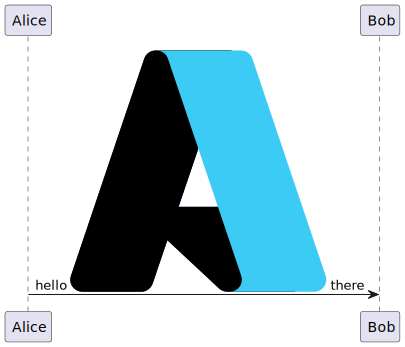

# Feature request: Full SVG linear gradient support for sprite SAX parser

**Is your feature request related to a problem? Please describe.**
The current SAX SVG sprite parser supports linear gradients but only uses the first and last stops. Intermediate stops, offsets, and `stop-opacity` are ignored, and gradient direction is reduced to horizontal, vertical, or diagonal. This causes SVG gradients (including fades to transparent) to render incorrectly.

Current behavior example (SAX parser output):



**Describe the solution you'd like**
Implement full SVG linear gradient support for sprite parsing so gradients behave like standard SVG:

- Respect all stops, offsets, and `stop-opacity`.
- Preserve gradient direction from `x1/y1/x2/y2` without reducing to PlantUML's four-direction policy.
- Keep existing PlantUML gradient syntax for non-SVG elements.

**Describe alternatives you've considered**
- Keep the current behavior and document limitations (already partially done).
- Convert SVG gradients to the existing PlantUML 4-direction gradient syntax, accepting reduced fidelity.

**Additional context**
Relationship to PlantUML gradient syntax:

> "You can also use color gradient for background colors, with the following syntax: two colors names separated either by:
> |,
> /,
> \\, or
> -
> depending on the direction of the gradient."

Example:

```
#blue\9932CC
```

This request does not change that syntax. Instead, SVG sprite parsing would use full SVG gradient semantics when `fill="url(#...)"` is present.

Design summary:
- Preserve full SVG gradient definitions (all stops, offsets, opacities, and gradient vectors).
- Introduce a multi-stop gradient model in the rendering pipeline for SVG sprites.
- Keep PlantUML's legacy gradient syntax unchanged for non-SVG styling.
- Maintain backward-compatible fallbacks when gradients are unsupported or malformed.

Implementation sketch:
1. Extend gradient parsing to capture `stop-opacity` and offsets.
2. Map SVG gradient definitions to a richer gradient model in PlantUML (supporting multiple stops).
3. Update SVG sprite rendering to apply the richer gradient model instead of collapsing to first/last stops.
4. Ensure fallback behavior remains compatible when gradients cannot be resolved.

Pseudo-code:
```java
// During defs collection
if ("stop".equals(qName) && currentGradient != null) {
	String offset = attrs.getValue("offset");
	String stopColor = attrs.getValue("stop-color");
	String stopOpacity = attrs.getValue("stop-opacity");
	GradientStop stop = new GradientStop(
		parseOffset(offset),
		parseColor(stopColor),
		parseOpacity(stopOpacity, 1.0)
	);
	currentGradient.stops.add(stop);
}

// During rendering
if (fill.startsWith("url(#")) {
	GradientDef gradient = defs.get(gradientId);
	if (gradient != null && gradient.isLinear()) {
		MultiStopGradient g = new MultiStopGradient(
			gradient.vector, // x1,y1,x2,y2
			gradient.stops  // offset, color, opacity
		);
		applyFillGradient(g);
	} else {
		applyFallbackColor();
	}
}
```

Notes:
- This is scoped to SVG sprites parsed by the SAX parser.
- PlantUML gradient syntax remains unchanged for non-SVG usage.
