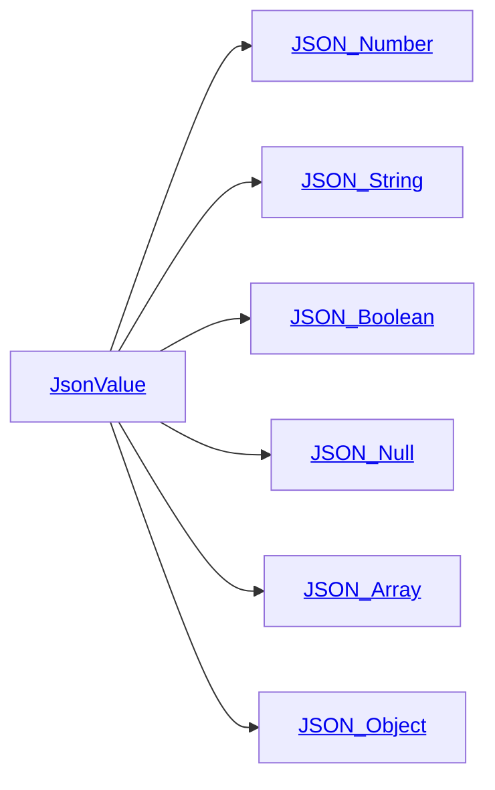

# Directory Documentation for `json`

## Description
This package provides classes used to manage [JSON](https://www.json.org) Data _(with the [minimal-json API](https://github.com/ralfstx/minimal-json))_.

## Link

## Reference
- [JSON _(on Wikipedia)_](https://en.wikipedia.org/wiki/JSON)

## Architecture of `JsonValue`

## Credit
- :octocat: [ralfstx/minimal-json](https://github.com/ralfstx/minimal-json)
- [`json`](../json/) _(included in PlantUML)_

## Misc.

