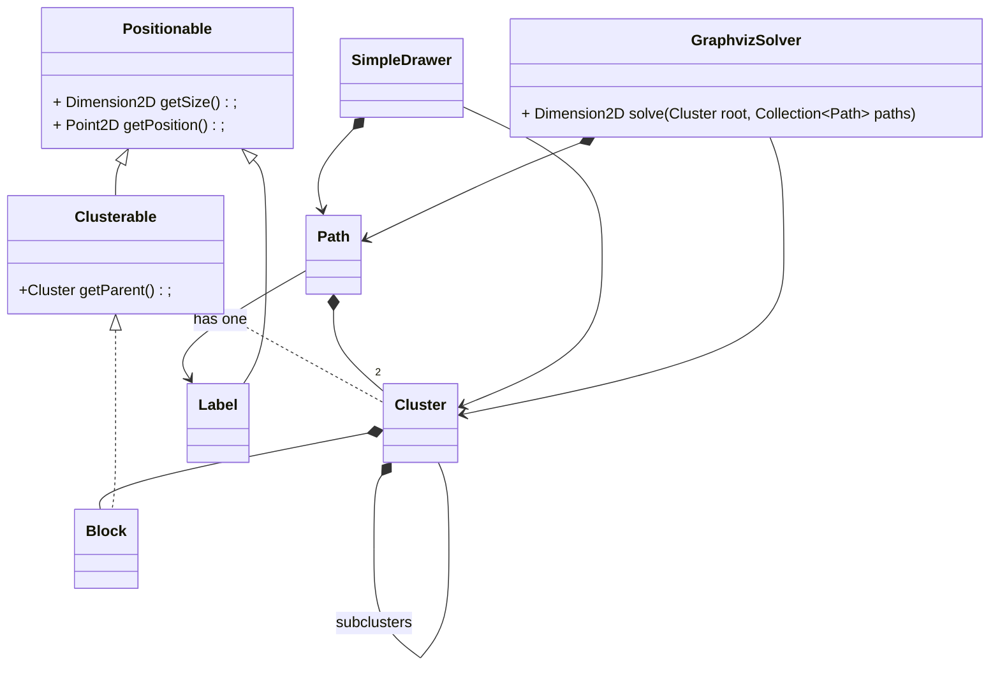

# Directory Documentation for `posimo`

## Description
This package provides classes used to manage Positioning Calculation.

## Diagram

```mermaid
classDiagram
class Positionable {
	+ Dimension2D getSize();
	+ Point2D getPosition();
}

class Clusterable {
	+Cluster getParent();
}

Positionable <|-- Clusterable

class Cluster

Cluster *-- Cluster : subclusters
Clusterable <|.. Cluster
Cluster *-- Block
Clusterable <|.. Block

Path *-- "2" Cluster
Path --> Label : has one
Positionable <|-- Label

SimpleDrawer --> Cluster
SimpleDrawer *--> Path

class GraphvizSolver {
 + Dimension2D solve(Cluster root, Collection~Path~ paths)
}
GraphvizSolver --> Cluster
GraphvizSolver *--> Path
```

_(src: [`data.txt`](./data.txt))_