# Scripts and Styles for Interactive SVGs

These files are embedded in the `<svg>` when the `svginteractive`
pragma option is enabled, e.g.:

```plantuml
@startuml
!pragma svginteractive true
...
```

The `sequencediagram.*` files are used for sequence diagrams
and the `default.*` files are used for other types of diagrams.

## Features
### Class Diagram Features
Hovering over an entity will cause most parts of the diagram to be
dimmed, highlighting only that hovered entity and any entities that
are directly linked to it. (The links are also highlighted.)
The highlighting is removed and the image returns to normal once
the mouse is no longer hovering on the entity.

Clicking on an entity will make the highlighting remain, even when
no longer hovering over it.
Clicking the same entity again, or pressing the `Esc` key, will
remove the highlighting.

The highlighting applied while hovering over an entity will take
precedence over any highlighting that was activated by a click.

### Sequence Diagram Features
Moving the mouse over the participant headers in the top part of
the diagram, reveals a 📌 "pin" button in the top-left corner.
Toggling this button allows the header to scroll vertically with
the page, so that it is always visible.

## Implementation Notes
### Support for Multiple Embedded SVGs in HTML
As far as possible, the effects of the embedded script should apply
only to the SVG in which they are embedded. The `document.currentScript`
property is used in the scripts to determine the current `<svg>` element.
Note that this property is [not available inside a callback or event 
handler](https://developer.mozilla.org/en-US/docs/Web/API/Document/currentScript).

### User-Defined Identifiers
We avoid including user-defined strings such as entity/participant names
in the SVG elements' `class` attribute because a name like "my entity"
will produce two different classes ("my" and "entity"), and many other
characters (`.`, `:`, `,`, `[`, etc.) would need to be escaped carefully.

Instead, we store these values in `data-*` attributes. No special escaping
is required for these when the SVG XML is first produced (aside from the
usual XML escaping e.g. `"` -> `&quot;`), and only limited escaping of
`"` and `\` characters is needed when using the attributes' values in a
CSS selector string.
