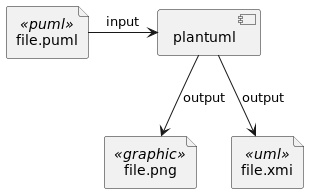
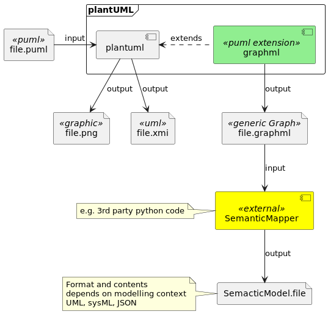

# Generic Model Export

## Motivation
plantUML is a great tool to generate and maintain drawings similar to source code. It is widely adopted for
lighweight software and system architecture design and documentation.
Major strengths are
* easy to use
* ability to extend the visualization with elements for different contexts 
	using the standard libary extensions
* de-facto standard for text based software architecture design and 
	documentation

**Status of Machine Readable Exports**

However is most cases the output is only a graphic. The semantics of the model elements is defined only by
its visual representation and is only accessible to human.

The currently existing approach of creating a machine readable format based on the UML semantics using
the XMI exchange format is only in very early stages and also ended up in a tool specific xmi format
dialects. The de facto industry standards like EA and in certain industries IBM rhapsody are not supported.

**Drawbacks**

* Having a large number of drawings bears the risk of having inconsistencies 
within the design model,
which are hard to identify, especially when dealing with larger software systems. Machine readable
output formats would be beneficial
* To enable meaningful checks based on model types, we would need a mapping 
	to elements with well defined semantics, e.g. UML classes, components, etc...
* designs created with plantUML can not be transferred into commercial UML 
	tools, like Enterprise Architect
* Lack of machine-readable/processable model information limits the usage of 
	plantUML in automotive contexts, where process requirements are imposed on 
	software design artifacts

## Problem to solve

* Make the architecture model machine-readable and processable
* Enable models-as-code for automotive applications
* provide the ability to map puml graphics to different semantic models, UML 
	and SysML as first step.
* Enable further processing of the model without the need of extending the 
	java code base of plantUML
* Keep lightweight approach and flexibility

## Proposal

* Realize a machine-readable representation of the internal data model
net.sourceforge.plantuml.cucadiagram, keeping the essential characteristics 
	of the diagram
Groups, Entities, Leafs and Links "Generic Graph Representation"

* add a semantic mapping from generic graph representation into a 
	machine-readable model with
defined semantics, e.g. UML or SysML. This can be realized as
  * external tool, e.g. python script
  * another plantUML diagram generator which depends on the generic graph 
		representation

## Benefits

The generic graph representation enables a transformation to various semantic models that can be
subject to further analysis, especially internal model consistency.

Every domain can add a mapping of plantUML to a semantic model, e.g. UML. 
This enables model checks or script based exports to commercial UML models.

Ultimately leading to a better adoption of plantUML usage within automotive SW 
development contexts.

## Current Status

### Implementation 

First shot is available, you can try it calling  

`plantuml -tgraphml -graphml-root-dir /path/to/project \
/path/to/project/some/dir/myArch.puml`

### Supported Diagram Types

* Class Diagram (most features)

