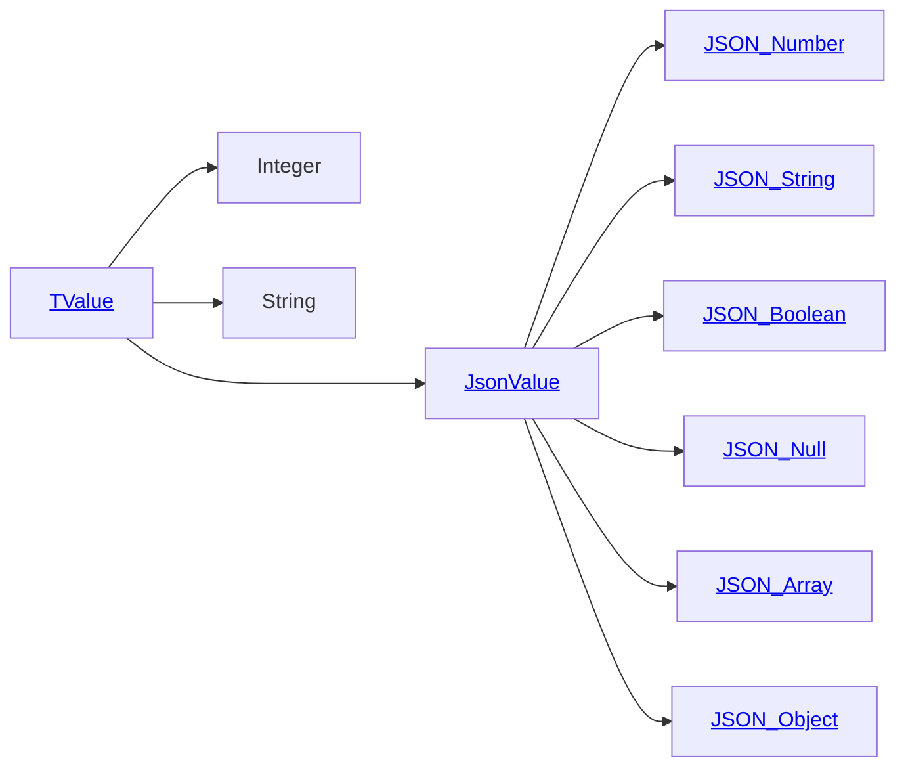

# Directory Documentation for `tim`

## Description
This package provides classes used to manage [PlantUML Preprocessing](https://plantuml.com/preprocessing).

## Link of Current Preprocessing (documentation)
- [PlantUML Preprocessing](https://plantuml.com/preprocessing)
- [PlantUML Preprocessing JSON](https://plantuml.com/preprocessing-json)

## See also [legacy] Preprocessing (directory)
- [`preproc`](../preproc/)
- [`preproc2`](../preproc2/)

## Architecture of `TValue`

## Reference
- [Shunting yard algorithm _(on Wikipedia)_](https://en.wikipedia.org/wiki/Shunting_yard_algorithm)
- [Reverse Polish notation _(on Wikipedia)_](https://en.wikipedia.org/wiki/Reverse_Polish_notation)
- [Boyer–Moore–Horspool algorithm _(on Wikipedia)_](https://en.wikipedia.org/wiki/Boyer%E2%80%93Moore%E2%80%93Horspool_algorithm)
- [String-searching algorithm _(on Wikipedia)_](https://en.wikipedia.org/wiki/String-searching_algorithm)
- [Trie _(on Wikipedia)_](https://en.wikipedia.org/wiki/Trie)

## Misc.
- [Tim (given name) _(on Wikipedia)_](https://en.wikipedia.org/wiki/Tim_(given_name))
