# Plantuml GraphML Export Test Case Overview

## classdiagram

<table>
<tr>
<th>File (.java)</th><th>PlantUML</th><th>Text</th>
</tr>
<tr><td>GML0000_Test</td><td>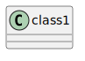</td><td><pre><code>@startuml
class class1
@enduml
</code></pre></td></tr>
<tr><td>GML0001_Test</td><td>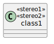</td><td><pre><code>@startuml
class class1 &laquo;stereo1&raquo; &laquo;stereo2&raquo;
@enduml
</code></pre></td></tr>
<tr><td>GML0002_Test</td><td>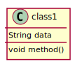</td><td><pre><code>@startuml
class class1 {
String data
void method()
}
@enduml
</code></pre></td></tr>
<tr><td>GML0003_Test</td><td></td><td><pre><code>@startuml
circle intf1
@enduml
</code></pre></td></tr>
<tr><td>GML0004_Test</td><td></td><td><pre><code>@startuml
() intf1
@enduml
</code></pre></td></tr>
<tr><td>GML0005_Test</td><td>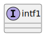</td><td><pre><code>@startuml
interface intf1
@enduml
</code></pre></td></tr>
<tr><td>GML0006_Test</td><td></td><td><pre><code>@startuml
diamond d1
@enduml
</code></pre></td></tr>
<tr><td>GML0007_Test</td><td></td><td><pre><code>@startuml
<> d1
@enduml
</code></pre></td></tr>
<tr><td>GML0008_Test</td><td>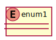</td><td><pre><code>@startuml
enum enum1
@enduml
</code></pre></td></tr>
<tr><td>GML0009_Test</td><td></td><td><pre><code>@startuml
class class1
entity ent1
@enduml
</code></pre></td></tr>
<tr><td>GML0010_Test</td><td></td><td><pre><code>@startuml
annotation anno1
@enduml
</code></pre></td></tr>
<tr><td>GML0011_Test</td><td>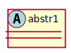</td><td><pre><code>@startuml
abstract class abstr1
@enduml
</code></pre></td></tr>
<tr><td>GML0012_Test</td><td>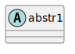</td><td><pre><code>@startuml
abstract abstr1
@enduml
</code></pre></td></tr>
<tr><td>GML0013_Test</td><td>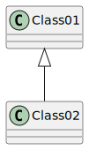</td><td><pre><code>@startuml
Class01 <|-- Class02
@enduml
</code></pre></td></tr>
<tr><td>GML0013b_Test</td><td>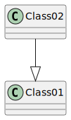</td><td><pre><code>@startuml
Class02 --|> Class01
@enduml
</code></pre></td></tr>
<tr><td>GML0014_Test</td><td></td><td><pre><code>@startuml
Class03 *-- Class04
@enduml
</code></pre></td></tr>
<tr><td>GML0014b_Test</td><td>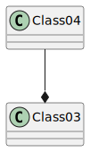</td><td><pre><code>@startuml
Class04 --* Class03
@enduml
</code></pre></td></tr>
<tr><td>GML0015_Test</td><td>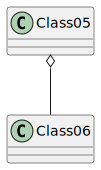</td><td><pre><code>@startuml
Class05 o-- Class06
@enduml
</code></pre></td></tr>
<tr><td>GML0016_Test</td><td>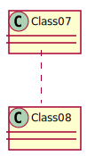</td><td><pre><code>@startuml
Class07 .. Class08
@enduml
</code></pre></td></tr>
<tr><td>GML0017_Test</td><td></td><td><pre><code>@startuml
Class09 -- Class10
@enduml
</code></pre></td></tr>
<tr><td>GML0018_Test</td><td>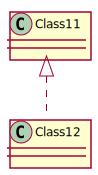</td><td><pre><code>@startuml
Class11 <|.. Class12
@enduml
</code></pre></td></tr>
<tr><td>GML0019_Test</td><td>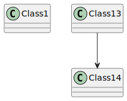</td><td><pre><code>@startuml
class Class1
Class13 --> Class14
@enduml
</code></pre></td></tr>
<tr><td>GML0020_Test</td><td>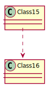</td><td><pre><code>@startuml
Class15 ..> Class16
@enduml
</code></pre></td></tr>
<tr><td>GML0020b_Test</td><td>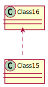</td><td><pre><code>@startuml
Class16 <.. Class15
@enduml
</code></pre></td></tr>
<tr><td>GML0021_Test</td><td>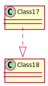</td><td><pre><code>@startuml
Class17 ..|> Class18
@enduml
</code></pre></td></tr>
<tr><td>GML0022_Test</td><td>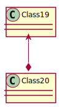</td><td><pre><code>@startuml
Class19 <--* Class20
@enduml
</code></pre></td></tr>
<tr><td>GML0022b_Test</td><td>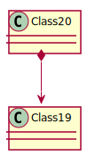</td><td><pre><code>@startuml
Class20 *--> Class19
@enduml
</code></pre></td></tr>
<tr><td>GML0023_Test</td><td>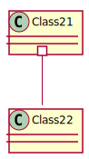</td><td><pre><code>@startuml
Class21 #-- Class22
@enduml
</code></pre></td></tr>
<tr><td>GML0024_Test</td><td>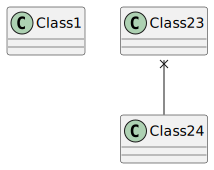</td><td><pre><code>@startuml
class Class1
Class23 x-- Class24
@enduml
</code></pre></td></tr>
<tr><td>GML0025_Test</td><td>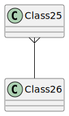</td><td><pre><code>@startuml
Class25 }-- Class26
@enduml
</code></pre></td></tr>
<tr><td>GML0026_Test</td><td>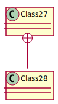</td><td><pre><code>@startuml
Class27 +-- Class28
@enduml
</code></pre></td></tr>
<tr><td>GML0026b_Test</td><td>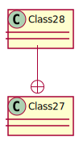</td><td><pre><code>@startuml
Class28 --+ Class27
@enduml
</code></pre></td></tr>
<tr><td>GML0027_Test</td><td></td><td><pre><code>@startuml
Class29 ^-- Class30
@enduml
</code></pre></td></tr>
<tr><td>GML0028_Test</td><td>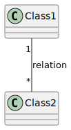</td><td><pre><code>@startuml
Class1 "1" -- "*" Class2: "relation"
@enduml
</code></pre></td></tr>
<tr><td>GML0029_Test</td><td>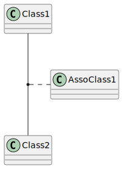</td><td><pre><code>@startuml
class Class1
class Class2
class AssoClass1
(Class1, Class2) .. AssoClass1
@enduml
</code></pre></td></tr>
<tr><td>GML0030_Test</td><td>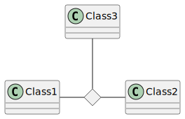</td><td><pre><code>@startuml
diamond d1
class Class1
class Class2
class Class3
Class1 -r- d1
Class2 -l- d1
Class3 -d- d1
@enduml
</code></pre></td></tr>
<tr><td>GML0031_Test</td><td>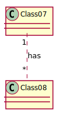</td><td><pre><code>@startuml
Class07 "1" .. "*" Class08: has
@enduml
</code></pre></td></tr>
<tr><td>GML0032_Test</td><td>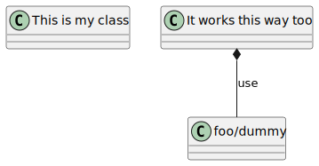</td><td><pre><code>@startuml
class "This is my class" as class1
class class2 as "It works this way too"

class2 *-- "foo/dummy" : use
@enduml
</code></pre></td></tr>
<tr><td>GML0033_Test</td><td>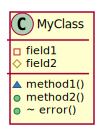</td><td><pre><code>@startuml
class MyClass {
-field1
#field2
~method1()
+method2()
+ ~ error()
}
@enduml
</code></pre></td></tr>
<tr><td>GML0034_Test</td><td>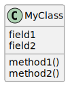</td><td><pre><code>@startuml
class MyClass {
{static} field1
field2
{abstract} method1()
method2()
}
@enduml
</code></pre></td></tr>
<tr><td>GML0035_Test</td><td>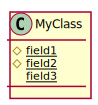</td><td><pre><code>@startuml
class MyClass {
# {static} field1
{static} # field2
{static} field3
}
@enduml
</code></pre></td></tr>
<tr><td>GML0036_Test</td><td></td><td><pre><code>@startuml
Class07 "1\nitsClass07" --> "*\nitsClass08" Class08: has
@enduml
</code></pre></td></tr>
<tr><td>GML0037_Test</td><td>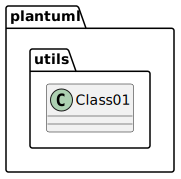</td><td><pre><code>@startuml
Class07 "itsClass07\n1" --> "itsClass08\n*" Class08: has
@enduml
</code></pre></td></tr>
<tr><td>GML0038_Test</td><td>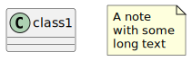</td><td><pre><code>@startuml
' Floating Note
class class1
note "A note\nwith some\nlong text" as N
@enduml
</code></pre></td></tr>
<tr><td>GML0039_Test</td><td>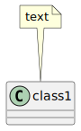</td><td><pre><code>@startuml
' Note connected to one class
class class1
note top of class1: text
@enduml
</code></pre></td></tr>
<tr><td>GML0040_Test</td><td>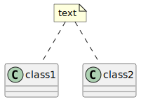</td><td><pre><code>@startuml
' Note on several classes
class class1
class class2
note "text" as N
N .. class1
N .. class2
@enduml
</code></pre></td></tr>
<tr><td>GML0041_Test</td><td>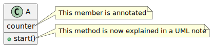</td><td><pre><code>@startuml
' Note on field and methods
' NOT SUPPORTED FEATURE
class A {
{static} int counter
+void {abstract} start(int timeout)
}
note right of A::counter
  This member is annotated
end note
note right of A::start
  This method is now explained in a UML note
end note
@enduml
</code></pre></td></tr>
<tr><td>GML0042_Test</td><td>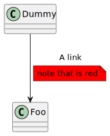</td><td><pre><code>@startuml
' Note on field and methods
' NOT SUPPORTED FEATURE
class Dummy
Dummy --> Foo : A link
note on link #red: note that is red
@enduml
</code></pre></td></tr>
<tr><td>GML0043_Test</td><td>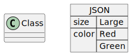</td><td><pre><code>@startuml
' JSON Data
class Class
json JSON {
   "size":"Large",
   "color": ["Red", "Green"]
}
@enduml
</code></pre></td></tr>
</table>

## component

<table>
<tr>
<th>File (.java)</th><th>PlantUML</th><th>Text</th>
</tr>
<tr><td>GML0000_Test</td><td>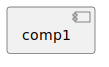</td><td><pre><code>@startuml
component comp1
@enduml
</code></pre></td></tr>
<tr><td>GML0001_Test</td><td></td><td><pre><code>@startuml
component comp1
component comp2
@enduml
</code></pre></td></tr>
<tr><td>GML0001b_Test</td><td>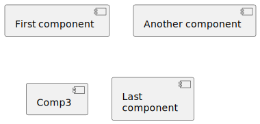</td><td><pre><code>@startuml
' multiple components with hidden layout links
[First component]
[Another component] as Comp2
component Comp3
component [Last\ncomponent] as Comp4
@enduml
</code></pre></td></tr>
<tr><td>GML0002_Test</td><td>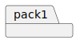</td><td><pre><code>@startuml
package pack1
@enduml
</code></pre></td></tr>
<tr><td>GML0003_Test</td><td>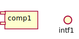</td><td><pre><code>@startuml
[comp1]
() "intf1"
@enduml
</code></pre></td></tr>
<tr><td>GML0004_Test</td><td>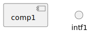</td><td><pre><code>@startuml
[comp1]
interface intf1
@enduml
</code></pre></td></tr>
<tr><td>GML0005_Test</td><td>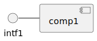</td><td><pre><code>@startuml
intf1 - [comp1]
@enduml
</code></pre></td></tr>
<tr><td>GML0006_Test</td><td>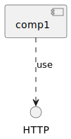</td><td><pre><code>@startuml
[comp1] ..> HTTP : use
@enduml
</code></pre></td></tr>
<tr><td>GML0007_Test</td><td>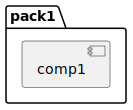</td><td><pre><code>@startuml
package "pack1" {
	component comp1
}
@enduml
</code></pre></td></tr>
<tr><td>GML0008_Test</td><td></td><td><pre><code>@startuml
component comp1
note right of comp1: A note\nwith some\nlong text
@enduml
</code></pre></td></tr>
<tr><td>GML0008b_Test</td><td>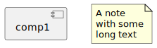</td><td><pre><code>@startuml
' floating note
component comp1
note "A note\nwith some\nlong text" as N
@enduml
</code></pre></td></tr>
<tr><td>GML0009_Test</td><td>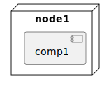</td><td><pre><code>@startuml
node "node1" {
	component comp1
}
@enduml
</code></pre></td></tr>
<tr><td>GML0010_Test</td><td></td><td><pre><code>@startuml
folder "folder1" {
	component comp1
}
@enduml
</code></pre></td></tr>
<tr><td>GML0011_Test</td><td>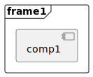</td><td><pre><code>@startuml
frame "frame1" {
	component comp1
}
@enduml
</code></pre></td></tr>
<tr><td>GML0012_Test</td><td></td><td><pre><code>@startuml
cloud "cloud1" {
	component comp1
}
@enduml
</code></pre></td></tr>
<tr><td>GML0013_Test</td><td></td><td><pre><code>@startuml
database "database1" {
	component comp1
}
@enduml
</code></pre></td></tr>
<tr><td>GML0014_Test</td><td></td><td><pre><code>@startuml
component C1 {
component C2
component C3
}
@enduml
</code></pre></td></tr>
<tr><td>GML0015_Test</td><td></td><td><pre><code>@startuml
' several ports on component
component comp1 {
  port port1
  portin port2_in
  portout port3_out
}
@enduml
</code></pre></td></tr>
<tr><td>GML0016_Test</td><td></td><td><pre><code>@startuml
'Connected ports on component
[i]
component C {
  portin p1
  portin p2
  portout po1
  portout po2
  component c1
}
[o]
i --> p1
i --> p2
p1 --> c1
po1 --> o
po2 --> o
c1 --> po1
@enduml
</code></pre></td></tr>
</table>

